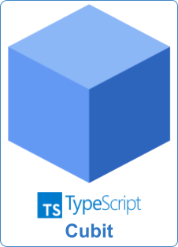

# Cubit for TypeScript

<p align="center">
  
</p>

A simple TypeScript implementation of Cubit, a lightweight state management library inspired by the Cubit pattern.

# Install

```
npm install git+https://github.com/tlimao/cubit-ts.git#<version>
```

*Replace `<version>` with the tag of the latest or preferred version.*

# Quick Start

The following examples demonstrate basic usage of Cubit for managing both simple and complex states.

## 1. Counter Cubit Example

This example shows a simple counter, where the state is a number that can be incremented or decremented. Implementations of Cubit can define custom methods, like increment and decrement, to control transitions between states.

```
// counter.cubit.ts

import { Cubit } from 'cubit-ts';

class CounterCubit extends Cubit<number> {

    constructor(state: number) {
        super(state)
    }

    public increment(): void {
        this.emit(this.state() + 1);
    }

    public decrement(): void {
        this.emit(this.state() - 1);
    }
}

const counterCubit: CounterCubit = new CounterCubit(0);

console.log(`State: ${counterCubit.state()}`); // Output: 0
counterCubit.increment();
console.log(`State: ${counterCubit.state()}`); // Output: 1
counterCubit.decrement();
console.log(`State: ${counterCubit.state()}`); // Output: 0
```

- To test the counter example, run: `npm run example -- examples/counter/couter.cubit.ts`

## 2. Cubit with Complex State Example

In cases where your state is more complex than a primitive type, such as an object with multiple attributes, you can use a custom class within **CubitState**.

```
// Complex Cubit State
import { Cubit, CubitState } from 'cubit';

class Complex {
    attr1: string;
    attr2: number;

    constructor(attr1: string, attr2: number) {
        this.attr1 = attr1;
        this.attr2 = attr2;
    }

    toString(): string {
        return `${this.attr1} - ${this.attr2}`;
    }
}

class ComplexState extends CubitState<Complex> {
    constructor(value: Complex) {
        super(value);
    }
}

class ComplexCubit extends Cubit<ComplexState> {

    constructor(state: ComplexState) {
        super(state)
    }

    public updateAttr1(attr1: string): void {
        const state: CubitState<Complex> = this.state();
        const new_state: CubitState<Complex> = new ComplexState(
            new Complex(
                attr1,
                state.value().attr2
            )
        )
        this.emit(new_state);
    }

    public updateAttr2(attr2: number): void {
        const state: CubitState<Complex> = this.state();
        const new_state: CubitState<Complex> = new ComplexState(
            new Complex(
                state.value().attr1,
                attr2
            )
        )
        this.emit(new_state);
    }
}

const initial_state: ComplexState = new ComplexState(new Complex("ricky", 0));
const complex_cubit: ComplexCubit = new ComplexCubit(initial_state);

console.log(`State: ${complexCubit.state().value().toString()}`); // "Ricky - 0"
complexCubit.updateAttr1("Ricky Sanchez");
console.log(`State: ${complexCubit.state().value().toString()}`); // "Ricky Sanchez - 0"
complexCubit.updateAttr2(64);
console.log(`State: ${complexCubit.state().value().toString()}`); // "Ricky Sanchez - 64"
```

- To test the counter example, run: `npm run example -- examples/complex/complex.cubit.ts`

# API Reference

**Cubit**

`emit(newState: T): void` - Updates the current state with newState.
`state(): T` - Returns the current state.
`stream(): BehaviorSubject<T>` - Returns an Observable that emits the current state whenever it changes. This allows external components or services to subscribe and react to state changes over time.

**State**

`value(): T` - Returns the encapsulated value of the state.

These methods allow seamless state updates and retrievals within Cubit and CubitState classes.

# Best Practices

1. For cubit files

File name format: `<name>.cubit.ts`
Example: `counter.cubit.ts`, `user.cubit.ts`

2. For cubit classes

Class name format: `class <Name>Cubit`
Example: `class CounterCubit`, `class UserCubit`

3. For cubit state files

File name format: `<name>.state.ts`
Example: `counter.state.ts`, `user.state.ts`

4. For cubit state classes

Class name format: `class <Name>State`
Example: `class CounterState`, `class UserState`

5. Code organization

- Create one file for cubit e one file for cubit states;

```
context/
  ├── counter.cubit.ts
  └── counter.state.ts
```

- For complex states, create a generic base cubit state and another with semantic names:

```
class GenericState { ... }

class SpecificState1 extends GenericState { ... }

class SpecificState2 extends GenericState { ... }
```